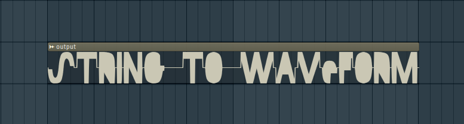

# Soltan-String-to-Waveform

  

## About
This python script converts input string to audio waveform using the **Waveform Genesis Bonus Pack** in Soltan's video description [here](https://www.youtube.com/watch?v=DKiDNV12cCU).

## Installation

1. Make sure you have python installed on your system
2. Download the **Waveform Genesis Bonus Pack** by **Milinor** from [here](https://www.toneden.io/soltan-2/post/download-waveform-genesis-bonus-package-by-milinor)
3. Clone the contents of this repository to the "1- Alphabet" folder
4. Run the _gen.py_ file and it will generate **output.wav** as the output

### Note
- Spaces are replaced with _sp.wav_ which is 0.321s long
- Extra space has been added between each letter (_small.wav_) which is 0.053s long
- For letters with multiple waveforms, a preffered one is used for readable outputs

## Contributing
- For anyone interested in the development of this project, feel free to send a pull request and I will review it
